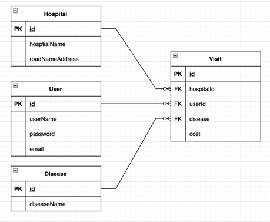

# 전국 병원정보 조회 API
로그인한 회원만 리뷰 작성할 수 있도록 구현

## ER 다이어그램

## User
### 회원가입 
POST /api/v1/users/join
- 이름(userName) 중복되지 않도록 구현

### 로그인
POST /api/v1/users/login
- userName, password 일치 시 토큰 발급

## Hospital
### 병원 조회
GET /api/v1/hospitals/{id}
- 병원 id로 조회 시 id, hospitalName, RoadNameAddress 응답

## Visits
### 방문 기록 남기기

POST /api/v1/visit
- 인증 필요 : Header에 login시 발급받은 토큰을 
"Bearer \<token\>" 형태로 넘겨야 접근 가능하다
- RequestBody
  - {"hospitalId" : \<Id>, 
  "diseaseName" : "<병명>",
  "cost" : \<비용> }
### 방문 기록 전체 조회
GET /api/v1/visit

### 방문 기록 병원 별 조회
GET /api/v1/visit/hospitals/{id}

### 방문 기록 유저 별 조회
GET /api/v1/visit/users/{id}

